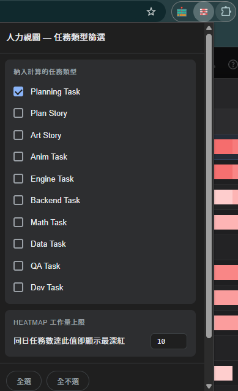
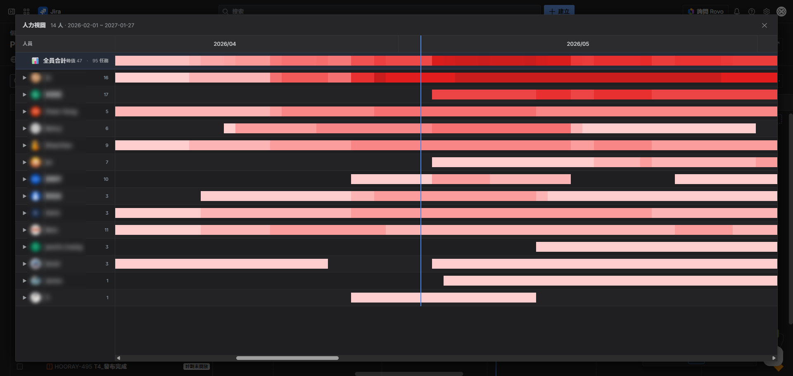
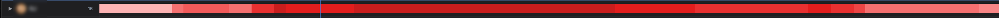
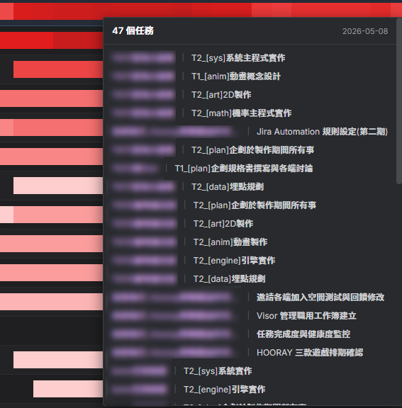
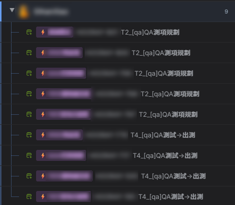
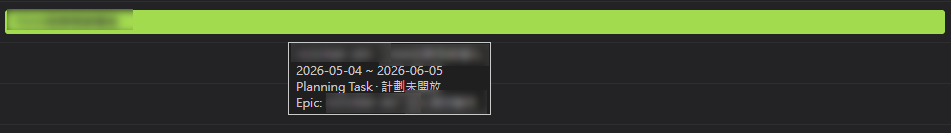

# Jira People View

Jira Timeline 人力視圖插件 — 把「以任務為主軸」翻轉為「以人為主軸」，每人一條 heatmap 看誰在什麼時段最忙；展開可看該人手上所有任務。

---

## 安裝

1. 解壓 `jira-people-view.zip` 到任意資料夾
2. `chrome://extensions/` → 開「開發人員模式」→「載入未封裝項目」→ 選該資料夾
3. 進到任一 Jira Timeline 頁面，右下角會出現「人力視圖」按鈕

---

## 設定面板

點 Chrome 工具列的插件圖示開啟設定面板，所有設定即時儲存。

### 設定項目

| 項目 | 預設 | 說明 |
|------|------|------|
| 納入計算的任務類型 | 全部 10 種勾選 | 勾哪些類型，heatmap 與展開列表才算進去 |
| Heatmap 工作量上限 | `5` | 同日任務數達此值即顯示最深紅；數字越大，色階分布越緩；範圍 1–20 |

可勾選的 10 種任務類型：
Planning Task、Plan Story、Art Story、Anim Task、Engine Task、Backend Task、Math Task、Data Task、QA Task、Dev Task。

底部按鈕：
- **全選** — 一鍵勾回所有 10 種
- **全不選** — 一鍵清空（清空後人力視圖不會抓任何任務）

#### 不在 popup 內的設定 / 行為（一律啟用）

- 排除「已完成 / 已關閉」狀態任務
- 排除沒指派人的任務
- 排除 Subtask、Milestone、Config、Bug、Epic
- 依工作量降冪排序人員（最忙的最上）
- 時間軸範圍自動從今天 ±90/+270 天延伸到資料範圍

---

## 功能

### 浮動入口按鈕

頁面右下角出現可拖曳的「⠿ ▦ 人力視圖」按鈕，點擊即開啟人力視圖視窗。

- 點按鈕主體 → 開啟人力視圖
- 拖左側 `⠿` 手把 → 移動位置（位置會記住）

---

### 主畫面 — 全員合計 + 人員列表

開啟後顯示一個浮動視窗，視覺仿 Jira Timeline 風格：

- **頂部「全員合計」row**：藍底高亮，顯示全員每日疊加任務總數的 heatmap。色階上限自動依人數調整（避免多人員合計很容易一片紅看不出波形）
- **下方人員列表**：每人一條 heatmap，**依工作量降冪排序**（最忙的浮在最上）
- 每人 row 末顯示該人在範圍內的任務總數
- 月份 header 沿頂部、今天位置有藍線、`±90/+270` 天為下限自動延伸到資料範圍

---

### Heatmap — 連續色階工作量視覺

每人一條色帶，沿時間軸顯示同日重疊任務數。任務越多顏色越深（從淡粉到深紅連續漸層，非固定 5 階）。

色階上限可在 popup 設定 — cap 越大，達到深紅所需的任務數越多。預設 5（同日 5 個任務即深紅）。

---

### Cell hover — 看當日任務清單

滑入 heatmap 任一段顯示完整任務清單，每筆顯示「Epic 名稱 ｜ 任務 summary」格式，紫色 Epic 名 + 灰白任務名。tooltip 可滑入捲動。

---

### 展開人員 — 樹狀檢視 + 任務 bar

點人員列前的箭頭展開，看該人手上所有任務排程：

- 左欄：每筆顯示 issue 圖示 + Epic 紫色 chip + issue key + summary
- 右欄：任務 bar 依職種類型上色（PT 綠 / Engine 藍 / Math 黃 / Art 紫 / Anim 粉 / Data 青 / QA 橘）
- 點任務 bar 或左欄任務名 → 開新分頁到該 Jira issue

任務 bar 時間軸滑鼠移入可看任務時間、狀態與所屬父系

---

### 互動細節

- **左欄寬度可拖拉** — 中間細線區域是調整 handle，拖移可加寬縮窄
- **方向鍵捲動** — 焦點在視窗時 `←` `→` 平移時間軸（一週）、`Shift+←/→` 跨一個月
- **Esc 關閉** — 或點視窗外暗色區域、右上 ✕

---

### 自動篩選規則

固定排除：
- 已完成 / 已關閉的任務（綠色狀態）
- 沒指派人的任務
- Subtask、Milestone、Config、Bug、Epic（這 5 種類型不納入個人工作量）

時間軸範圍：今天前 3 個月 ~ 後 9 個月為下限；資料超出時自動向兩端延伸（保留 14 天緩衝）。初始捲動位置自動置中於今天藍線。

---

## 小提醒

- 開啟視圖後資料抓一次 quasi-realtime 顯示，要看最新請關閉重開
- 看不到人 → popup 確認有勾任務類型，且 Jira 真有符合條件的任務
- 任務 bar 沒顯示 → 該任務沒填 Start date 或 due date；不影響 heatmap，只是展開列看不到 bar
- 仍有問題請聯絡維護者
