# PT Timeline Color

Jira Timeline 視覺強化插件 — 為 Planning Task / Milestone / Epic 加上區別色與形狀，並標出週末與台灣國定假日。配合可拖曳浮動 bar 切換啟用 / 重新整理。

---

## 安裝

1. 解壓 `pt-timeline-color.zip` 到任意資料夾
2. `chrome://extensions/` → 開「開發人員模式」→「載入未封裝項目」→ 選該資料夾

---

## 設定面板

點 Chrome 工具列的插件圖示開啟設定面板，所有設定即時儲存。

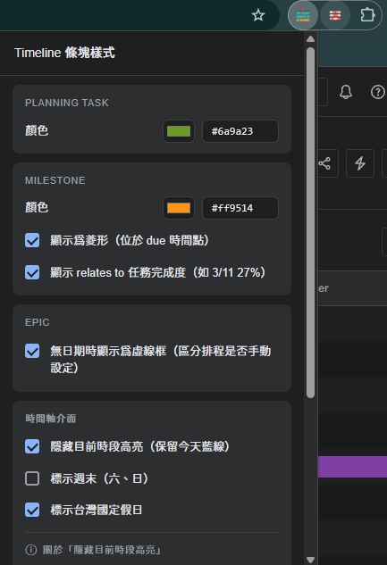

### 設定項目

| 區塊 | 項目 | 預設 | 說明 |
|------|------|------|------|
| Planning Task | 顏色 | `#6a9a23` 綠 | PT bar 染色，色票或直接輸入 HEX 都可 |
| Planning Task | 鎖定拖曳與拉長 | OFF | 防誤動 PT 日期；鎖定下從左欄任務名開啟側欄 |
| Milestone | 顏色 | `#FF8B00` 橘 | Milestone bar 染色 |
| Milestone | 顯示為菱形 | OFF | bar 改為位於 due 日的菱形（時間點語意）|
| Milestone | 顯示 relates to 完成度 | OFF | bar 上標示 `3/11 27%` 進度徽章 |
| Epic | 依自定欄位顯示為虛線框 | OFF | `customfield_10919 = 啟用` 的 Epic 顯示虛線外框，便於追蹤特定 Epic |
| Epic | 鎖定拖曳與拉長 | OFF | 防誤動 Epic 日期；鎖定下從左欄任務名開啟側欄 |
| 時間軸介面 | 隱藏目前時段高亮 | OFF | 拿掉 Jira 預設的當月／當週／當季半透明色塊（今天藍線保留）|
| 時間軸介面 | 標示週末 | OFF | 六、日欄淡灰 |
| 時間軸介面 | 標示台灣國定假日 | OFF | 內建 2025–2027 假日，淡橘 |
| 時間軸介面 | Hover/拖拉顯示工作天數 | OFF | 結束日標籤加「(工作天 X 天)」，自動扣掉週末與國定假日 |
| 專注模式 | 展開 Epic 自動篩選 | OFF | 展開 Epic 時自動只顯示該 Epic 與子任務，收合或關閉時還原 |

底部「**重設預設**」按鈕：把所有設定還原為上表預設值。

---

## 功能

### 浮動操作 bar

頁面右下角會出現可拖曳的浮動操作 bar，啟用切換與「立即重新整理」都在這裡。

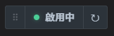

- 點左半段的「啟用中」/「已停用」→ 切換插件總開關
- 點右側 ↻ → 強制重新抓資料、重畫畫面
- 拖左側 `⠿` 手把 → 移動位置（位置會記住）
- 點 `⠿` 手把以外的區域不會誤觸拖曳

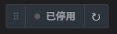

---

### Planning Task — 條塊上色 / 鎖定

PT 類型的 bar 染成自訂色，與 Engine/Math 等職種任務區隔。預設綠色 `#6a9a23`，可在 popup 自訂。

popup「鎖定拖曳與拉長」勾選後，PT bar 上的拖曳與兩端拉伸都被禁用（防誤動）。鎖定狀態下點擊 bar 不會開側欄，從左欄任務名點開即可。

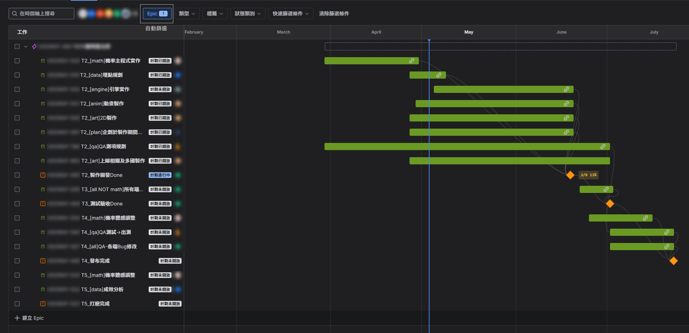

---

### Milestone — 顏色 / 菱形 / 進度徽章 / hover 任務清單

Milestone 是「時間點」而非「時間區間」，本插件提供四個強化：

- **自訂顏色** — 預設橘色 `#FF8B00`
- **菱形顯示**（popup 切換）— bar 改為位於 due 日的菱形，符合「時間點」語意
  - 自動隱藏左側重複日期、右側「(N 天)」後綴；只留結束日
  - 鎖定前後拉長，避免誤拉成區間（預設行為）
- **進度徽章**（popup 切換）— 自動依 issue link `relates to` 算出 `3/8 27%` 標在 bar 上
- **Hover 任務清單** — 滑入菱形顯示完整 relates to 任務列表，含完成 / 進行中 / 待辦狀態圖示

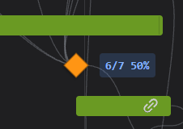

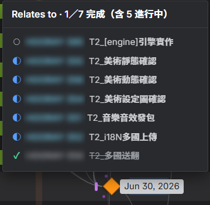

---

### Epic — 依自定欄位顯示為虛線框

依自定欄位 `customfield_10919` 標記為「啟用」的 Epic，bar 改為虛線外框，便於在 Timeline 上一眼分辨需要被特別關注或追蹤的 Epic。

---

### Planning Task — Hover 職種標籤

滑入 PT bar 顯示該任務的職種 tag（綠色 chip），方便快速辨認是哪個職種的任務。

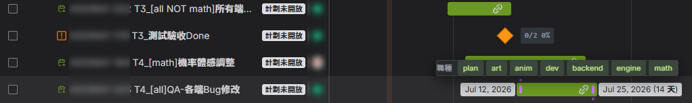

---

### 時間軸介面

- **隱藏目前時段高亮**（popup 切換）— Jira 預設半透明月份背景色塊；今天藍線保留
- **週末標示**（popup 切換）— 六、日欄淡灰
- **國定假日標示**（popup 切換）— 台灣國定假日淡橘（依行政院人事行政總處公告，內建 2025–2027）
- **方向鍵捲動**（預設行為）— `←` `→` 平移、`Shift+←/→` 跨大段
- **工作天數**（popup 切換）— hover / 拖拉時，bar 結束日標籤後會多一段「(工作天 X 天)」，自動扣掉週末與國定假日。靜態 hover 顯示 bar 區間的工作天總數；拖拉中會跟著日期變動即時更新

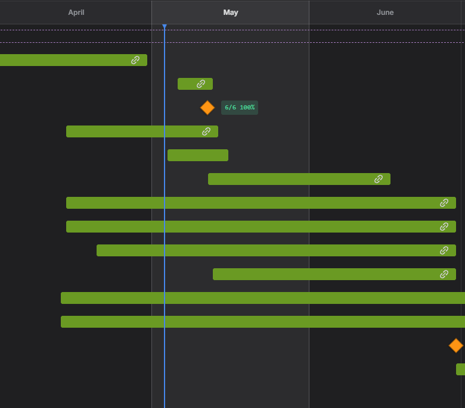
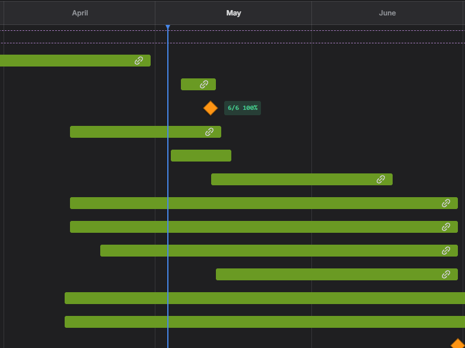

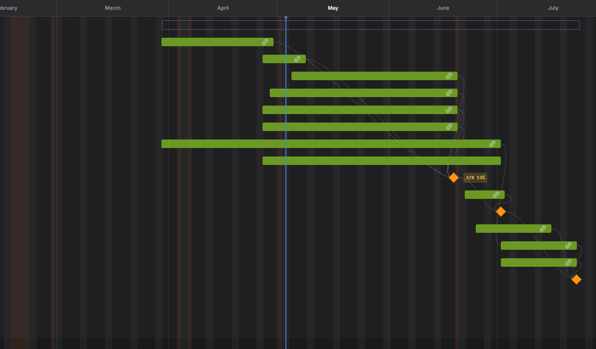

- **相依性線優化**（預設行為）— Jira 原生連線改為更細、半透明，hover 不再彈「檢視相依性詳細資料」popup（要看連結請看 bar 右端的鎖鍊圖示）

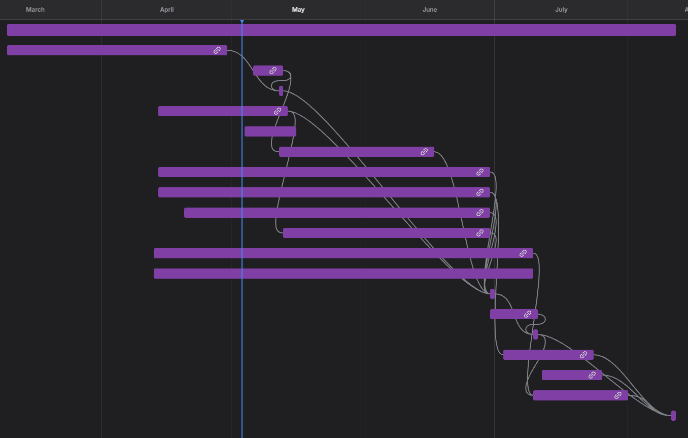
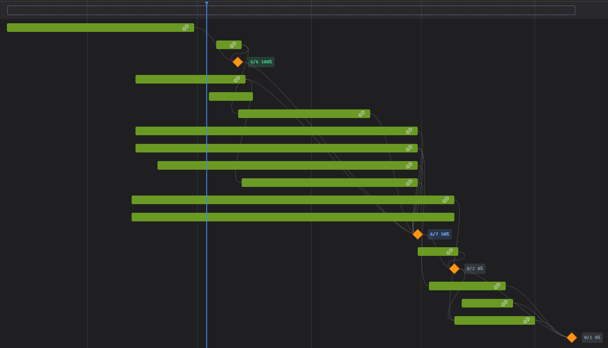

---

### 專注模式

展開任一 Epic 時自動只顯示該 Epic 與子任務（Jira 內建 Epic 篩選）。收合或關閉時還原。

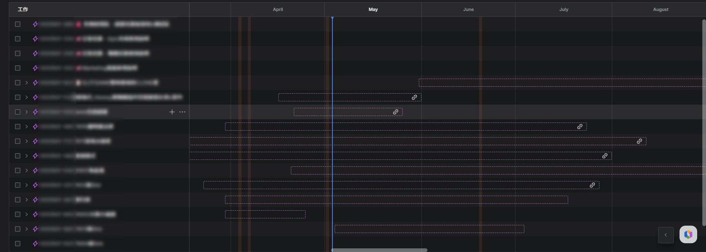
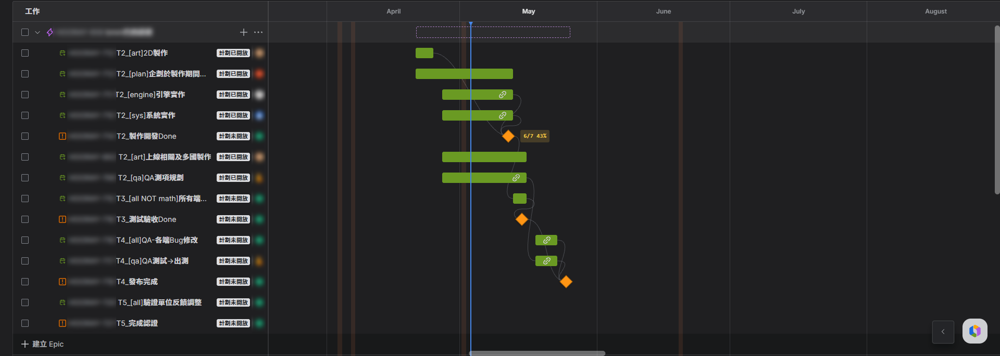

---

## 小提醒

- 拖過 bar 改日期後 1~2 秒會自動更新；其他變更（Epic 改日期、relates 完成度變動等）系統每小時自動同步一次，要立即看到請按 ↻
- 插件停用後所有自訂樣式會立刻還原為 Jira 原生外觀
- 仍有問題請聯絡維護者
